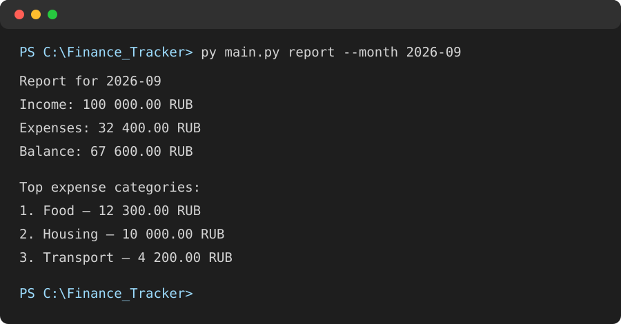

# Finance Tracker

Finance Tracker is a personal-finance application with a Flask web interface and a command-line interface. It stores income and expenses in SQLite, provides filters and monthly reports, and exports selected records to CSV.

The web interface includes a dashboard, transaction history, filters, an add-transaction form, monthly reports, and deletion of transactions. Both interfaces work with the same SQLite database.

## Technologies

- Python 3.10+
- SQLite (`sqlite3` from the standard library)
- Flask and Jinja templates
- HTML5 and responsive CSS
- `argparse` for the command-line interface
- `unittest` for automated tests

## Installation and web launch

Clone the repository and open its folder in PowerShell:

```powershell
cd C:\path\to\Finance_Tracker
```

Create and activate a virtual environment, then install the dependencies:

```powershell
py -m venv .venv
.\.venv\Scripts\Activate.ps1
py -m pip install -r requirements.txt
```

Start the local web server:

```powershell
py app.py
```

Open [http://127.0.0.1:5000](http://127.0.0.1:5000) in a browser. The SQLite database (`finance_tracker.db`) is created automatically when the application first runs.

## Web pages

| Page | URL | What it does |
| --- | --- | --- |
| Dashboard | `/` | Shows income, expenses, balance, top categories, and recent transactions. |
| Transactions | `/transactions` | Shows every transaction and filters by date range or category. |
| Add transaction | `/add` | Adds income or an expense after server-side validation. |
| Monthly report | `/report?month=YYYY-MM` | Shows a month’s totals, balance, and three largest expense categories. |

The transaction page also supports deletion. A confirmation dialog appears before the request is sent.

## Project structure

```text
Finance_Tracker/
├── app.py                 # Flask routes and web behaviour
├── database.py            # SQLite queries and database connection
├── validators.py          # Transaction and date validation
├── main.py                # Command-line interface
├── templates/             # Jinja HTML templates
├── static/style.css       # Responsive interface styles
├── tests/                 # Unit tests
└── finance_tracker.db     # Local SQLite database
```

## Command-line interface

The original terminal version remains available. It uses the same database as the web app.

```powershell
py main.py --help
```

## Commands

| Command | Description |
| --- | --- |
| `add --type income\|expense --amount AMOUNT --category CATEGORY [--description TEXT] [--date YYYY-MM-DD]` | Add a transaction. The date defaults to today. |
| `list [--from YYYY-MM-DD] [--to YYYY-MM-DD] [--category NAME] [--export FILE.csv]` | List transactions for a period or category and optionally save exactly those results as CSV. |
| `delete` | Choose and remove a transaction by its ID. |
| `balance [--month YYYY-MM]` | Show income, expenses, and balance for all time or for one month. |
| `report --month YYYY-MM` | Show a monthly report and the top three expense categories. |

## Tests

The test suite covers validation, database creation and reading, filters, balance calculations, and the top-three expense report.

Run it with:

```powershell
py -m unittest discover -s tests -v
```

## Command-line examples

Add an income and an expense with explicit dates:

```powershell
py main.py add --type income --amount 100000 --category Salary --description "September salary" --date 2026-09-01
py main.py add --type expense --amount 12300 --category Food --description "Groceries" --date 2026-09-02
```

Filter a category within a date range and export the displayed records:

```powershell
py main.py list --from 2026-09-01 --to 2026-09-30 --category Food --export food-september.csv
```

Monthly report output:

```text
Report for 2026-09
Income: 100 000.00 RUB
Expenses: 32 400.00 RUB
Balance: 67 600.00 RUB

Top expense categories:
1. Food — 12 300.00 RUB
2. Housing — 10 000.00 RUB
3. Transport — 4 200.00 RUB
```



## Future ideas

- Configurable currency and locale-aware formatting
- Edit existing transactions
- Budget limits and notifications by category
- Charts for income and expense trends
- User accounts and authentication
